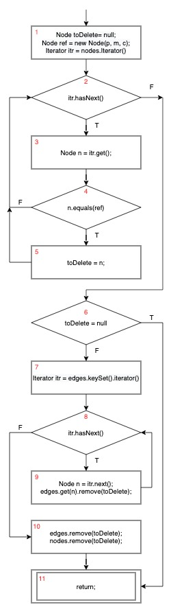
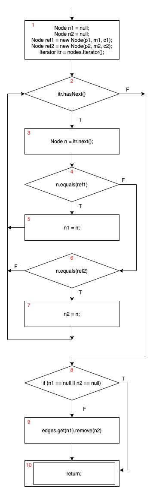

Luke Jiang   
jiang700@purdue.edu   

## Question 1

C/C++:  (output -1)
```C
#include <stdio.h>

int main()
{
    printf("%i", (-5) % 2);

    return 0;
}
```
Java:    (output -1)
```Java
public class HelloWorld {

     public static void main(String []args){
        System.out.println((-5) % 2);
     }
}
```
Python:    (output 1)
```Python
print((-5) % 2)
```
Perl:     (output 1)
```Perl
print ((-5) % 2);
```

After running previous 4 code snippets, I found out that C, C++ and Java output -1, but Perl and Python output 1.

The reason for this discrepancy is because different languages have different implementations. In C/C++ and Java, the negative sign is prepended to the output, but this is not the case for Python or Perl.

Strategies:
  1. The compiler/interpreter can disallow negative input completely and throw an error message when it encounters one.
  2. Developers can develop a habit of always use an `abs` function to the result of a modulo operation.
  3. Compilers can analyze the program in compile time to give alert of potential negative inputs to the modulo operation.
  4. Programming languages can agree on a new standard that always output a nonnegative number.


## Question 2
Valgrind Output:
```
==184638==
==184638== HEAP SUMMARY:
==184638==     in use at exit: 9 bytes in 1 blocks
==184638==   total heap usage: 7 allocs, 6 frees, 2,115 bytes allocated
==184638==
==184638== LEAK SUMMARY:
==184638==    definitely lost: 9 bytes in 1 blocks
==184638==    indirectly lost: 0 bytes in 0 blocks
==184638==      possibly lost: 0 bytes in 0 blocks
==184638==    still reachable: 0 bytes in 0 blocks
==184638==         suppressed: 0 bytes in 0 blocks
==184638== Rerun with --leak-check=full to see details of leaked memory
==184638==
==184638== For counts of detected and suppressed errors, rerun with: -v
==184638== ERROR SUMMARY: 0 errors from 0 contexts (suppressed: 0 from 0)
```
(a) The problem is that when the program exits, not all allocated memories are freed. The bug for test case 1 is that when a node is to be deleted from the linked list in function delete_node, the str field of that node is not freed. Therefore, I fixed it by freeing the str field before freeing the node

(b) The problem is that there are some invalid pointer dereference as well as some invalid address input for the free function inside delete_all and i. The bug for this case is that the pointer p is not updated to NULL after all nodes in the list are freed, so when delete_all is called consecutively 2 times, in the second time, it will point to a block that is already freed.

(c) The following test case would generate an error when run with Valgrind:
```
[(i)nsert,(d)elete,delete (a)ll,d(u)plicate,(e)dit,(p)rint,e(x)it]:i
enter the tel:>100
enter the name:>Tom

[(i)nsert,(d)elete,delete (a)ll,d(u)plicate,(e)dit,(p)rint,e(x)it]:u
enter the tel:>100

[(i)nsert,(d)elete,delete (a)ll,d(u)plicate,(e)dit,(p)rint,e(x)it]:e
```

Valgrind would report:
```
==52345== Invalid write of size 1
==52345==    at 0x4C32E0D: strcpy (in /usr/lib/valgrind/vgpreload_memcheck-amd64-linux.so)
==52345==    by 0x108F39: duplicate (sll_fixed.c:193)
==52345==    by 0x1092FA: main (sll_fixed.c:320)
==52345==  Address 0x522d973 is 0 bytes after a block of size 3 alloc'd
==52345==    at 0x4C2FB0F: malloc (in /usr/lib/valgrind/vgpreload_memcheck-amd64-linux.so)
==52345==    by 0x108F1F: duplicate (sll_fixed.c:192)
==52345==    by 0x1092FA: main (sll_fixed.c:320)
```

The bug is at the malloc call of function duplicate. The variable len is the length of the str field without counting the null character, but the size of char array to allocate should include the size of the null character. Therefore, changing the malloc size from len to (len + 1) fixes the bug.

## Quesiton 3


## Question 4
(a)  
TRs for NC:
```
{1,2,3,4,5,6,7,8,9,10,11}
```

TRs for EC:
```
{  
   [1,2],[1,3],  
   [2,3],  
   [3,4],[3,5],[3,6],[3,7],  
   [4,8],  
   [5,8],  
   [6,7],  
   [7,8],  
   [8,9],[8,10],  
   [9,11],  
   [10,11]  
}
```

unfeasible EC edges:
```
{ [6,8] }
```
Since `case 2` in `switch` doesn't have a `break` statement, node 6 will always
go to 7 instead of 8.

TRs for EPC:
```
{  
   [1,2,3],  
   [1,3,4],[1,3,5],[1,3,6],[1,3,7],  
   [2,3,4],[2,3,5],[2,3,6],[2,3,7],  
   [3,4,8],  
   [3,5,8],  
   [3,6,7],  
   [3,7,8],  
   [4,8,10],  
   [5,8,9],
   [6,7,8]
   [7,8,9],
   [8,9,11],  
   [8,10,11]  
}
```

unfeasible EPC subpaths:
```
{  
  [3,6,8],[6,8,9],[6,8,10],  
  [4,8,9],  
  [5,8,10],[7,8,10]  
}
```
Paths [3,6,8],[6,8,9],[6,8,10] are unfeasible because they contain unfeasible edge [6,8]
Path [4,8,9] is unfeasible because edge [4,8] is possible iff `args.length()` equals to 0,
which means node 8 always takes the `false` branch.
Path [5,8,10],[7,8,10] are unfeasible because edges [5,8],[7,8] are possible iff `args.length` is
greater than zero, which means node 8 always takes the `true` branch.

TRs for PPC:
```
{  
    [1,2,3,4,8,10,11],  
    [1,2,3,5,8,9,11],  
    [1,2,3,6,7,8,9,11],  
    [1,2,3,7,8,9,11],  

    [1,3,4,8,10,11],  
    [1,3,5,8,9,11],  
    [1,3,6,7,8,9,11],  
    [1,3,7,8,9,11],  
}
```
unfeasible PPC subpaths:
```
{  
    [1,2,3,4,8,9,11]  
    [1,2,3,5,8,10,11],  
    [1,2,3,6,8,9,11], [1,2,3,6,8,10,11],  
    [1,2,3,6,7,8,10,11],  
    [1,2,3,7,8,9,11],  

    [1,3,4,8,9,11]  
    [1,3,5,8,10,11],  
    [1,3,6,8,9,11], [1,3,6,8,10,11],  
    [1,3,6,7,8,10,11],  
    [1,3,7,8,10,11],  
}
```


## Question 5
### addNode:
For function `addNode`, the test suite achieves NC and EC. The CFG of my implementation is the following:  
  
From `createCFG()`, we know that initially the graph contains 90 nodes, which have positions 0 to 89. Therefore, when `addNode` is called, it will traverse the for loop multiple times and then it will discover that the node to add is not in `nodes`, so the program will create the node to add, and insert it into `nodes`. Thus, `addNode` achieves node coverage and it covers all edges except the edge [4, 6], which happens when the node to add is already contained by `nodes`. This edge is covered by `addNode_duplicate`. Therefore, the test suite achieves EC as well.
### addEdge:
For function `addNode`, the test suite doesn't achieve NC or EC. The CFG of my implementation is the following:  
  
Test case `addEdge` adds an edge whose two vertices are absent in `nodes`. Based on this semantics, it covers nodes [1,2,3,4,6,8] and edges [1,2], [2,3], [3,4], [4,6], [6,2], [2,8]. Test case `addEdge_oneNewNode` adds an edge whose first vertex is already present in `nodes`. This test case covers an additional node 5 and edges [4,5], [5,2]. However, edges [6,7], [7,2] and node 7 are not covered, because the second vertex is not a new node. Therefore, I created an additional test case `addEdge_twoNewNodes` which adds an edge of two nodes that are already present in `nodes`. Now all edges and vertices are covered.
### deleteNode:
For function `deleteNode`, the test suite achieves NC and EC. The CFG of my implementation is the following, with the `foreach` loop translated with an explicit iterator:  
  
Test case `deleteNode_missing` deletes a single node that is present in `nodes`. Based on this semantics, the test case covers all nodes and all edges except the edge [6, 11], which happens when the node to delete is not present. This case is covered by the test case `deleteNode_missing`. So the test suite achieves full NC and EC.
### deleteEdge:
For function `deleteEdge`, the test suite achieves NC and EC. The CFG of my implementation is the following:  
  
Test case `deleteEdge` deletes an edge whose nodes are present in `nodes` and the edge itself is also present. Based on this semantics, the test case covers all the nodes and all edges except [8, 10], which happens when one of the vertices of the edge to delete is not present in `nodes`. This edge is covered by `deleteEdge_missing`, which tries to delete an edge whose vertices are not present in `nodes`. Therefore, the test suite achieves full NC and EC.
### isReachable:
For function `isReachable`, the test suite achieves NC but not EC. The CFG of my implementation is the following:  

The test case `reachable_true` searches two nodes that are both in `nodes`. In this case, all nodes and edges in nodes 1 to 7 are covered. By investigating the structure of the input CFG, I found out that for this test case, the set `visited` always empty, since there are no loops traversed by the DFS from the starting node to the end node. Therefore, this test case covers all edges except [8, 18] and [16, 14] and all nodes except node 18. The edge [8, 18] and the node 18 are covered by `reachable_missingSrc`, but no other test cases provided actually covered edge [16, 14]. So the test suite achieves node coverage but not edge coverage. Therefore, I added another test case that adds an additional edge to form a loop. This time, edge [16, 17] is covered.
